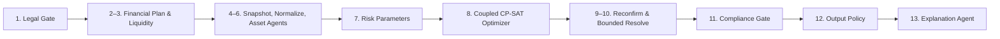

# Kiến trúc hệ thống

## Nguyên tắc bất biến

1. LLM không được tính hoặc sửa số liệu.
2. Optimizer chạy đầy đủ trước khi Output Policy quyết định phần được công bố.
3. `RESEARCH_EDUCATION` chỉ phát hành `COMPARE_ONLY` ở cấp nhóm tài sản; product allocation vẫn được tính nhưng không công bố mã chứng khoán kèm số tiền.
4. Mọi dữ liệu sản phẩm có timestamp, nguồn, quyền sử dụng, provenance và verification status.
5. Không tự nới lỏng ràng buộc khi vô nghiệm.

## Luồng 13 bước

## Coupled optimizer

Biến quyết định là số đơn vị/số tiền của từng `AssetProduct`. Ràng buộc nhóm tài sản được đặt trực tiếp trên tổng các biến sản phẩm, nên tầng chiến lược và triển khai được giải đồng thời.

Mô hình bao gồm:

- capital reconciliation;
- minimum/maximum investment;
- activation binary;
- bước làm tròn/lô giao dịch;
- segment binary cho `WHOLE_BALANCE_TIER` và `PIECEWISE_COST`;
- trần nhóm tài sản theo risk capacity và horizon;
- thanh khoản tối thiểu;
- risk-budget tuyến tính;
- product count để phương án có thể thực thi/giải thích.

Sau khi CP-SAT trả nghiệm, Risk Engine dùng covariance giả định theo nhóm để tính volatility, VaR 95%, CVaR 95%, Sharpe, HHI và ba stress test. Compliance Gate chặn bất kỳ scenario nào vượt risk ceiling hoặc không đối soát vốn.

Quote reconfirmation chạy trong vòng lặp giới hạn tối đa 3 lần. Mỗi trạng thái có signature từ scenario, product amount, tier/rate/cost; trạng thái lặp được đánh dấu cycle thay vì tiếp tục vô hạn hoặc tự nới ràng buộc.

## Phân tách schema

- `FullCalculationOutput`: chứa product allocations, universe, infeasibility, pipeline trace.
- `ReleasedOutput`: chỉ chứa trường được Output Policy lựa chọn.
- `ExplanationPayload`: `reasoning`, `source_reference`, `warning`, `confidence`, `generated_by`.

Ở `RESEARCH_EDUCATION`, `ReleasedScenario.allocations` sao chép nguyên trường `asset_class_allocations` do optimizer đã tính. Output Policy không cộng lại, làm tròn lại hoặc thay đổi con số.

## Persistence và audit

SQLite lưu product registry, user profile, recommendation run, full/released output, chat, confirmation, transaction demo và audit log. Mỗi recommendation có:

- `recommendation_id`;
- `data_snapshot`;
- `model_version`;
- 13 audit events theo đúng thứ tự pipeline.

SQLite có thể thay bằng PostgreSQL ở tầng repository mà không đổi schema API/domain.

Report service chỉ đọc `ReleasedOutput` để tạo PDF; vì vậy báo cáo không làm rò rỉ product amount bị ẩn trong `RESEARCH_EDUCATION`.

## Lớp vận hành production

API riêng tư dùng token HMAC có hạn sử dụng. Tất cả recommendation, audit, chat,
confirmation và PDF đều kiểm tra owner; vai trò `admin` có quyền kiểm tra nội bộ.
Frontend giữ token trong local storage cho phiên trình diễn và tự gắn Bearer header.

Middleware gắn request ID, security headers, giới hạn kích thước request, rate limit
theo IP/phương thức và ghi latency/status vào `api_events`. `/ready` trả HTTP 503 nếu
database hoặc khóa ký production không đạt yêu cầu.

SQLite chạy WAL, busy timeout và migration registry, phù hợp triển khai một instance.
Khi cần nhiều instance hoặc lưu lượng lớn, thay repository bằng PostgreSQL và rate
limiter in-memory bằng Redis mà không đổi domain schema hay API contract.
